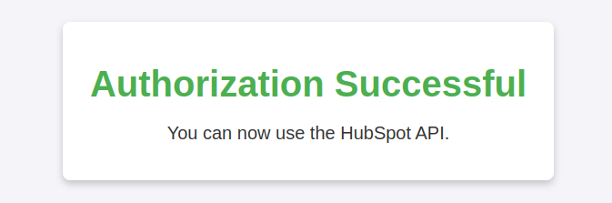

# HubSpot Integration Project

Este projeto é uma aplicação Spring Boot para integração com a API do HubSpot, incluindo processamento de webhooks e gerenciamento de contatos.  
A documentação da API com Swagger pode ser acessada [aqui](http://localhost:8080/swagger-ui/index.html#/), e uma discussão técnica sobre decisões tomadas, motivação para o uso das bibliotecas e possíveis melhorias futuras está disponível [aqui](documentacaotecnica.md).

## Pré-requisitos

Certifique-se de ter os seguintes itens instalados em sua máquina:

- **Docker Desktop**
- **Ngrok** (para expor a aplicação local e receber webhooks)

## Configuração do Projeto


1. **Configure o Ngrok** para redirecionar requisições externas:
   ```bash
   ngrok http 8080
    ```
   - Copie a URL pública gerada (ex.: `https://<subdomínio>.ngrok-free.app`) para configurar o HubSpot. 

2. **Configure seu aplicativo no HubSpot**:
      - Adicione a URL do Ngrok com o caminho `/auth/callback` na aba de autenticação:
     ```text
     Exemplo: https://<subdomínio>.ngrok-free.app/auth/callback
     ```
   - Adicione os escopos `crm.objects.contacts.read` e `crm.objects.contacts.write`.
   - Após criar o aplicativo, copie o **ID do cliente** e o **Segredo do cliente**.
3. **Configure Webhooks no HubSpot**:
   - Adicione a URL do Ngrok com o caminho `/webhook`:
   ```text
   Exemplo: https://<subdomínio>.ngrok-free.app/webhook
   ```
   - Ative a assinatura para eventos de `contact.creation`.
4. **Atualize o arquivo `application.properties`**:
    ```properties
    jasypt.encryptor.password=<sua-senha>
    hubspot.client.id=<id-do-cliente>
    hubspot.client.secret=<segredo-do-cliente>
    hubspot.redirect.uri=https://<subdomínio>.ngrok-free.app/auth/callback
    ```
5. **Crie e inicie os containers Docker**:
   - Execute os comandos abaixo para garantir que os containers sejam recriados e iniciados corretamente:
   ```bash
     docker-compose down --remove-orphans
     docker-compose build --no-cache api
     docker-compose up -d
     ```
   - Esses comandos também podem e devem ser usados após mudanças no código-fonte
## Autenticação no HubSpot

Antes de utilizar a API para criar um contato no HubSpot, é necessário obter um token de acesso:

1. Acesse a seguinte url no seu navegador.
   ```bash
      'https://<subdomínio>.ngrok-free.app/auth/url'
   ```
2. Acesse a URL retornada e clique em "Permitir acesso"
3. Se tudo estiver correto, você verá uma mensagem de sucesso como abaixo e o token de acesso será salvo no banco PostgreSQL automaticamente



## Observação sobre Sessão e Testes com Postman

> **Importante:** O fluxo de autenticação OAuth2 utiliza sessão HTTP para proteger contra ataques CSRF. O parâmetro `state` é salvo na sessão do usuário e validado no callback. Por isso:
>
> - **Sempre realize o fluxo completo de autenticação no mesmo navegador, aba e domínio/porta.**
> - Se for testar com Postman, é necessário copiar manualmente o cookie `JSESSIONID` da resposta do endpoint `/auth/url` e enviá-lo na requisição para `/auth/callback`. Caso contrário, a sessão será diferente e a autenticação falhará.
> - Em produção, navegadores gerenciam cookies automaticamente, então esse problema não ocorre para usuários finais.
> - Se receber erro de "Sessão expirada ou inválida", tente novamente garantindo que o fluxo está sendo feito na mesma sessão.

## Criando um Contato

Com o token de acesso salvo, envie uma requisição `POST` para `/contact/` com o corpo no formato JSON:

   ```bash 
      curl --location 'https://<subdomínio>.ngrok-free.app/contact' \
      --header 'Content-Type: application/json' \
      --data-raw '{
      "email": "irvy@lumon.industries",
      "lastName": "J.",
      "firstName": "Irvy"
      }'
   
   ```
A aplicação incluirá automaticamente o token no cabeçalho da requisição para o HubSpot. 
Os contatos criados podem ser verificados diretamente no HubSpot ou listados pelo endpoint /contact/.

   ``` bash
   curl --location 'https://<subdomínio>.ngrok-free.app/contact'
   ```

## Webhook

Ao receber um webhook de criação de contato, será possível visualizar um log no console da aplicação.Exemplo:

   ``` bash
   2025-04-29 00:20:48 2025-04-29T03:20:48.737Z  INFO 1 --- [HubspotIntegration] [nio-8080-exec-1] c.e.h.controller.WebhookController       : Evento recebido: HubSpotWebhookEvent(appId=123456, eventId=7890, subscriptionId=12345, portalId=54321, occurredAt=1679876543210, subscriptionType=contact.creation, attemptNumber=1, objectId=987654, changeSource=CRM, changeFlag=new)
   2025-04-29 00:20:48 2025-04-29T03:20:48.758Z  INFO 1 --- [HubspotIntegration] [nio-8080-exec-1] c.e.h.controller.WebhookController       : Evento enviado para RabbitMQ: HubSpotWebhookEvent(appId=123456, eventId=7890, subscriptionId=12345, portalId=54321, occurredAt=1679876543210, subscriptionType=contact.creation, attemptNumber=1, objectId=987654, changeSource=CRM, changeFlag=new)
   2025-04-29 00:20:48 2025-04-29T03:20:48.769Z  INFO 1 --- [HubspotIntegration] [ntContainer#0-2] c.e.h.component.RabbitConsumer           : Consumindo evento: HubSpotWebhookEvent(appId=123456, eventId=7890, subscriptionId=12345, portalId=54321, occurredAt=1679876543210, subscriptionType=contact.creation, attemptNumber=1, objectId=987654, changeSource=CRM, changeFlag=new)
   2025-04-29 00:20:48 2025-04-29T03:20:48.770Z  INFO 1 --- [HubspotIntegration] [ntContainer#0-2] c.e.h.service.ContactService             : Processando evento de criação de contato: HubSpotWebhookEvent(appId=123456, eventId=7890, subscriptionId=12345, portalId=54321, occurredAt=1679876543210, subscriptionType=contact.creation, attemptNumber=1, objectId=987654, changeSource=CRM, changeFlag=new)
   ```